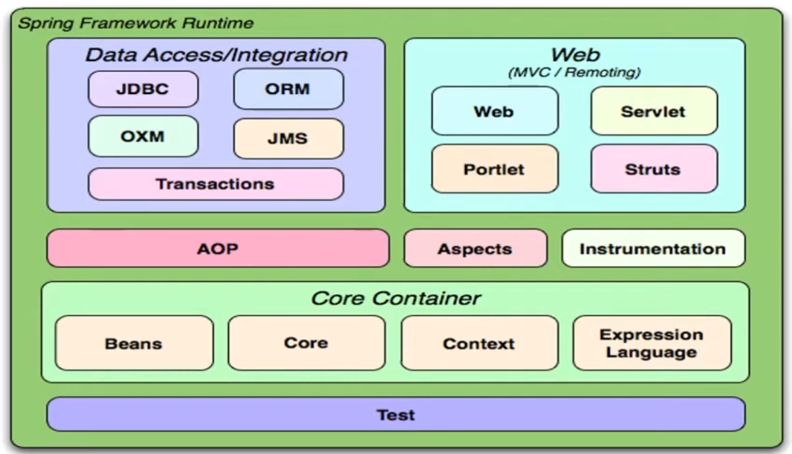
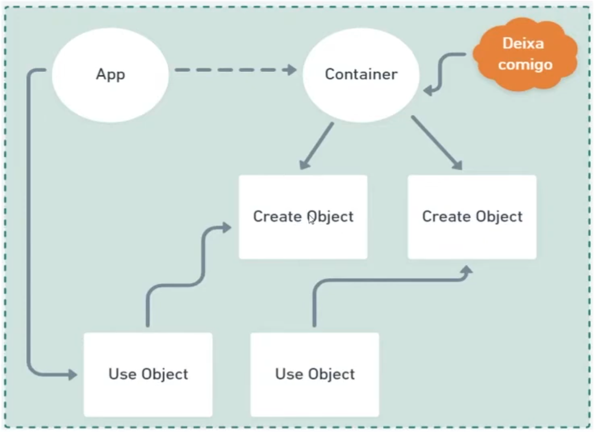
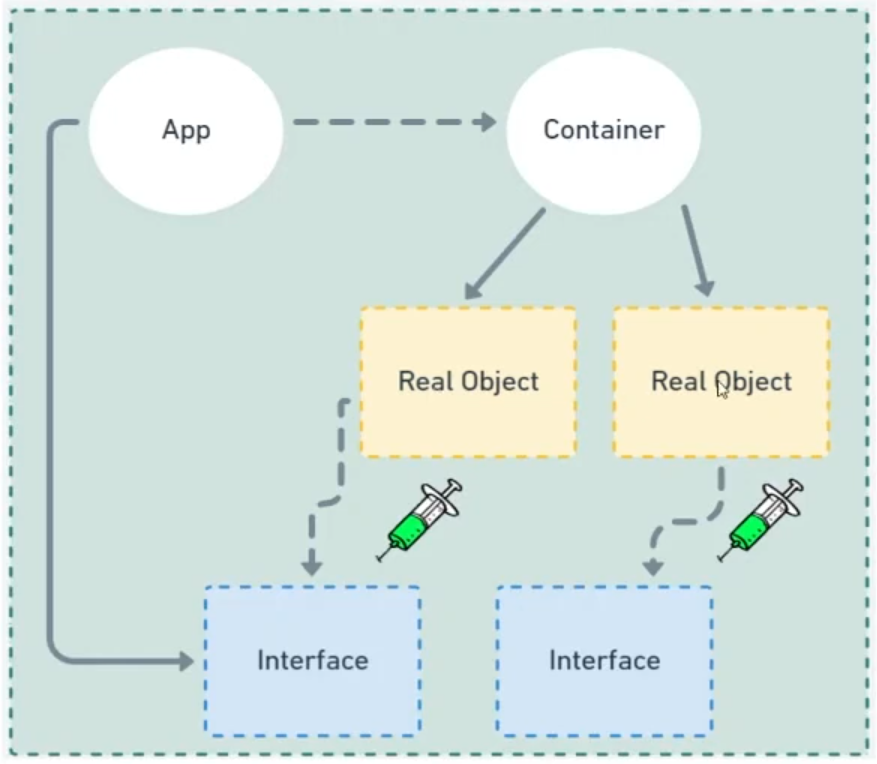

## Fundamentos do Spring Framework

* O que é?

    * É um framework open source desenvolvido para plataforma java baseado nos padrões de projetos inversão de controle e injeção de dependência. 
    * É composto por módulos afim de `reduzir a complexidade` no desenvolvimento
    * Alguns desses módulos são: 

    

* Spring x Java EE

    * Java EE tem muito mais verbosidade e burocracia comparado ao Spring antigamente, sendo então mais simples e fácil de usar o Spring

* Conceito de inversão de controle

    * Trata-se do redirecionamento do fluxo de execução de um código retirando parcialmente o controle sobre ele e delegando-o para um container -> `minimizar o acoplamento do código`

    

* Injeção de dependências

    * Padrão de desenvolvimento com a finalidade de manter baixo o nível de acoplamento entre módulos de um sistema.

    

* Beans / AutoWired / Scopes

    * Beans é um objeto que é instanciado, montado e gerenciado por um container através da inversão de controle.
    * Possuimos 5 tipos de conceitos diferentes : **Singleton, Prototype, Request, Session, Global**, onde os 3 últimos são do contexto HTTP.
        * Singleton: o conteiner do IOC define apenas uma instância do objeto.
        * Prototype: será criado um novo objeto a cada solicitação ao container.
        * HTTP Request: um bean será criado para cada requisição HTTP.
        * HTTP Session: um bean será criado para cada sessão de usuário.
        * HTTP Global: um bean será criado para o ciclo de vida do contexto da aplicação.
    * Autowired: uma anotação onde deverá ocorrer uma injeção automática de dependência.
        * byName: buscado um método set que corresponde ao nome do Bean.
        * byType: considerado o tipo da classe para inclusão do Bean.
        * byConstructor: usamos o construtor para incluir a dependência.

## Springboot

* O que é?

    * Diferente do Spring, que foca no padrão de injeção de dependências, o Springboot foca na configuração automática.
    * Antes dele, a dependência era individual, com alta verbosidade, incompatibilidade de versões, complexidade de gestão e configurações complexas e repetitivas.
    * Como a maior parte das configurações necessárias para o início de um projeto são sempre as mesmas, ele inicia um projeto com essas configurações já definidas.

* Starters

    * São descritores de dependência que reduzem em maior parte as dependências do arquivo, condensando-as.
    * Entre os benefícios temos: aumento da coesão, as versões ficam compatíveis, otimização do tempo, configuração simples e foco no negócio.

* Principais Starters
    * Spring-boot-starter-*
        * `data-jpa`: integração ao banco de dados via JPA - Hibernate
        * `data-mongodb`: interação com banco de dados MongoDB
        * `web`: inclusão do container Tomcat para aplicações REST
        * `web-services`: Webservices baseados na arquitetura SOAP
        * `batch`: Implementação de JOBs de processos
        * `test`: disponibilização de recursos para testes unitários como o JUnit 
        * `openfeign`: client HTTP baseado em interfaces
        * `actuator`: gerenciamento de monitoramento da aplicação

### Beans x Components

* Quando usar @Bean?

    * Quando não é nada da sua aplicação e não tem acesso a inicializar o arquivo (como de bibliotecas externas).

* Quando usar @Component?

    * Quando são componentes que tenho acesso no código fonte, serão escaneados na aplicação.

### Values

É possível definir valores no application.properties para associar a algumas variáveis.

```java
@Component
public class SistemaMensagem implements CommandLineRunner {
    @Value("${name:NoReply}") // Caso nao ache o value name, coloca o default
    private String nome; // Pega o valor de @Value
    @Value("{email}")
    private String email;
}
```

### Configuration properties

É um bean de configuração que todos os seus valores de configuração vem do `configuration.properties`. É possível utilizá-lo através do `@Configuration` e do `@ConfigurationProperties(prefix = "remetente")` e adicionar esse prefixo no application.properties nos valores desejados.

### Java Persistence API - JPA

* O que é ORM?

    * Object-Relational Mapping é um recurso para aproximar o paradigma da orientação ao objetos ao contexto de banco de dados relacional.
    * É realizado através do mapeamento de objeto para uma tabela por uma biblioteca ou framework.

* Java Persistence API

    * Especificação baseada em interfaces, que através de um framework realiza operações de persistência de objetos em Java.
    * **Hibernate, Eclipse Link, Top Link, Open JPA** são algumas implementações

* Mapeamentos

    * Possuem alguns aspectos, tais quais: **identificação, definição, relacionamento, herança, persistência**.

```java
@Entity
@Table(name="usuario")
public class Usuario{
    @Id
    @GenerateValue(strategy=generationType.AUTO)
    @Column(name="id_usuario")
    private Long id;

    private String nome;

    @Column(name="login_usuario")
    private String login;

    @Column(name="senha_usuario")
    private String senha;
}
```

* EntityManager


### Spring Data JPA

É um novo recurso disponibilizado pelo Spring Framework que adiciona uma camada sobre o JPA, usando todos os recursos definidos pela JPA, especialmente os mapeamentos de entidade e os recursos de persistência baseado em interfaces e anotações. Ele adiciona então seus próprios recursos, como uma implementação no code do padrão de repositórrio e a criação de consultas de bancos de dados a partir de nomes e métodos.

A interação com o banco de dados será através de herança de interfaces e declaração de métodos com anotações.

* Interfaces: **CrudRepository, JPARepository, PagingAndSortingRepository**
* Anotações: **@Query, @Param**